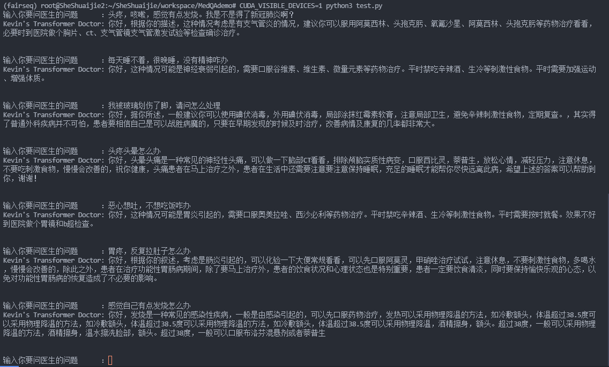

# Transformer Seq2Seq的医疗问答 
Medical QA based on Seq2Seq Transformer

对于Transformer实现的一个实例使用

## 数据获取 Data Source
数据源为Github项目

## 模型设定 Model setting
基础的Transformer
6 layer Encoder + 6 layer Decoder

## 运行方式 How to Run
训练Train：python3 main.py
测试Inference：python3 test.py

## Example

## 参考
Trainer实现：minGPT on Github

Transformer 实现：
http://nlp.seas.harvard.edu/2018/04/03/attention.html

